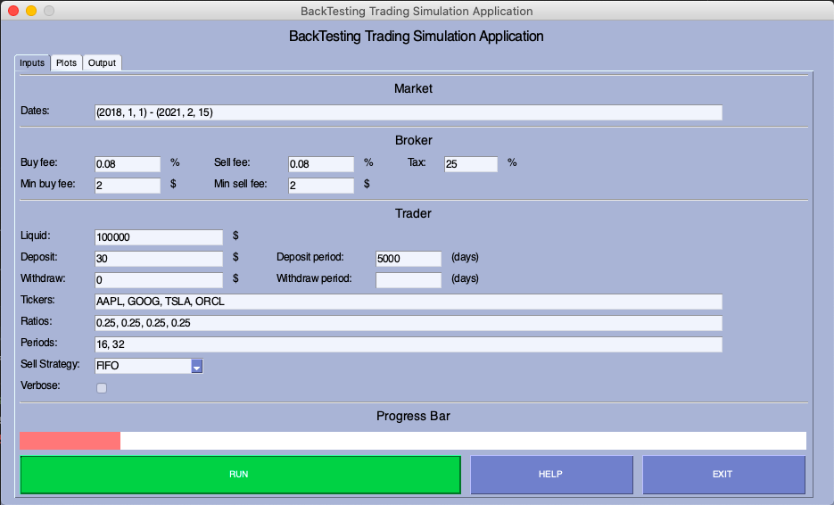
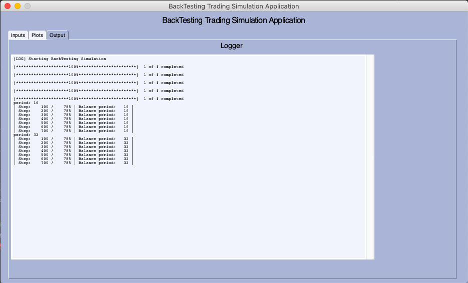
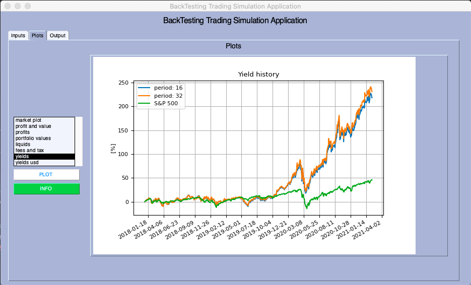

# Python Trader Backtest

Python Trader Backtest is an app for backtesting simple trading strategies based on historical trading data from the yfinance python package. The application enables variations of portfolio periodic balancing with a weighted averaged portfolio value for a variety of selling strategies like, FIFO (First In First Out), LIFO (First In Lirst Out) or TAX_OPT that picks which stock to sell next by minimizing the amount of tax payed in the transaction.

---

## Requirements
| #   | package            | version   |
|:----:|:--------------:|:------------:|
| 1   | pandas |  1.2.2 |
| 2   | numpy |  1.19.5 |
| 3   | matplotlib |  3.2.0 |
| 4   | yfinance |  0.1.67 |
| 5   | PySimpleGUI |  4.55.1 |


## Notebook

| #   | file            | Subject                                         | Colab             | Nbviewer               |
|:----:|:--------------:|:------------------------------------------------:|:-----------------:|:---------------------:|
| 1   | `backtesting_simulator.ipynb` | Runing the full simulator in Jupyter notebook   | []()        | []()|


## Command Line API

You should run the `main.py` file in the `src` folder with the following arguments:

|Argument             | Description                                                                                   |
|-----------------------|-----------------------------------------------------------------------------------------------|
|`-tickers`             | The tickers to trade in, type=str, required=True, nargs='+'                     |
|`-periods`             | Periods to test balancing periods, type=int, required=True, nargs='+'                            |
|`-ratios`              | The balancing process is happens according to the ratios, type=float, required=True, nargs='+'                             |
|`-start_date`          | Initial date of trading , type=int, required=True, nargs='+'                                                |
|`-end_date`            | Final date of trading , type=int, required=True, nargs='+'  |
|`-deposit`             | The amount to deposit in a periodic fasion, type=float, default=0.0                                    |
|`-deposit_period`      | The period of deposit, type=int, default=30                                                          |
|`-buy_fee`             | Transaction buying fee in percents, type=float, default=0.08                                              |
|`-min_buy_fee`         | Transaction minimal buying fee, type=float, default=2.                         |
|`-sell_fee`            | Transaction selling fee in percents, type=float, default=0.08|
|`-min_sell_fee`        | Transaction minimal selling fee, type=float, default=2. |
|`-tax`                 | The amount of tax on profits in percents, type=float, default=25.                                         |
|`-liquid`              | The trader's initial liquid, type=float, required=True                                              |
|`-verbose`             | Print to terminal the balancing process (slowers the simulation), type=bool, default=True                                              |
|`-plots_normalize`     | Normalizing the market plots to unity, type=bool, default=True                                                               |
|`-sell_strategy`       | The selling strategy for which the trader will follow, type=str, default='FIFO', choices='FIFO', 'LIFO', 'TAX_OPT'                   |

For example:
```
python3 main.py -liquid=100000 -tickers 'AAPL' 'GOOG' 'SPY' 'ORCL' -periods 2 10 20  -ratios 0.25 0.25 0.25 0.25 -deposit 1000 -deposit_period 10 -verbose False -start_date 2019 1 1 -end_date 2021 1 1
```

## The App
This repository also contains a simple (and a bit ugly) python app with the same functionality of the original API. The app got three windows:
- Input window which contain the input parameters to the market, broker and trader classes


- Output window for textual progress display 


- Plots window for ploting the simulation results


---
Enjoy ...


 
