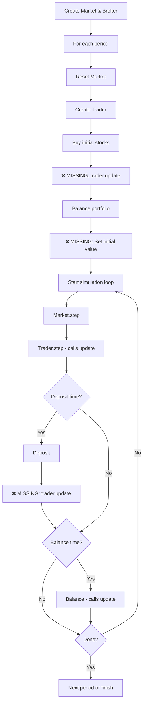

# Simulator Workflow Analysis

## Executive Summary

**STATUS: FIXED ✓** - Critical issues in the simulator workflow regarding `Trader.update()` usage have been identified and resolved. The simulator now correctly updates portfolio values at all necessary points.

## Current Workflow in `src/main.py`

### Initialization (Lines 14-17)
```python
market = Market(tickers, start_date=start_date, end_date=end_date)
broker = Broker(buy_fee, min_buy_fee, sell_fee, min_sell_fee, tax, my_market=market)
first_date = cp.copy(market.current_date)
```

### Per-Period Loop (Lines 19-57)

For each balance period:

1. **Reset Market** (Lines 23-24)
   ```python
   market.current_idx = 0
   market.current_date = first_date
   ```

2. **Create Trader** (Lines 27-28)
   ```python
   trader = Trader(liquid, balance_period, broker, market, verbose, sell_strategy)
   ```

3. **Initial Purchase** (Lines 31-32)
   ```python
   for ticker in tickers:
       trader.buy(ticker, 1)
   ```

4. **Initial Balance** (Line 37)
   ```python
   trader.balance(tickers, p=ratios)
   ```

5. **Simulation Loop** (Lines 38-55)
   ```python
   while not done:
       steps += 1
       done, previous_date = market.step()        # Market advances
       trader.step(previous_date)                 # Trader updates
       
       if deposit > 0 and steps % deposit_period == 0:
           trader.deposit(deposit)
       
       if steps % trader.balance_period == 0:
           trader.balance(tickers, p=ratios)
   ```

## Method Call Chain Analysis

### `Trader.update()` Purpose
From [`src/traders.py:216-232`](src/traders.py:216-232):
- Updates `portfolio_market_value` based on current market prices
- Calculates `portfolio_profit` 
- Updates `fees_and_tax`

### Where `Trader.update()` IS Called

1. **Inside `trader.step()`** (Line 241)
   - Called automatically every simulation step
   - Updates portfolio values
   - Records history

2. **Inside `trader.balance()`** (Line 459)
   - Called after executing all balance trades
   - Updates portfolio values before verification

### Where `Trader.update()` is NOT Called (ISSUES)

#### ❌ Issue 1: After Initial Purchases (Line 32)
**Current Code:**
```python
for ticker in tickers:
    trader.buy(ticker, 1)
trader.balance(tickers, p=ratios)  # Line 37
```

**Problem:**
- After buying initial stocks, `trader.update()` is never called
- `trader.balance()` calls `_collect_portfolio_data()` which uses `market.get_stock_data()` directly
- However, `portfolio_market_value` and `portfolio_profit` are NOT updated
- This means the first balance operation works with stale portfolio values

**Impact:**
- The initial balance calculation may use incorrect portfolio values
- `portfolio_initial_value` might not be set correctly (it's set in `step()` at line 254-255)

#### ❌ Issue 2: After Deposits (Line 51)
**Current Code:**
```python
if deposit > 0 and steps % deposit_period == 0:
    trader.deposit(deposit)
```

**Problem:**
- Deposits add liquid but don't trigger portfolio update
- The next balance operation will see the new liquid but portfolio values aren't refreshed
- This is less critical since `balance()` recalculates everything, but inconsistent

**Impact:**
- Minor: Portfolio metrics between deposit and next step are stale
- The history recorded in the next `step()` will be correct

#### ❌ Issue 3: Missing Initial Portfolio Value
**Current Code:**
```python
# Line 32: Buy stocks
for ticker in tickers:
    trader.buy(ticker, 1)

# Line 37: Balance portfolio
trader.balance(tickers, p=ratios)

# Line 38-47: Start simulation loop
while not done:
    steps += 1
    # ...
    done, previous_date = market.step()
    trader.step(previous_date)  # First call sets portfolio_initial_value
```

**Problem:**
- `portfolio_initial_value` is set in `trader.step()` at line 254-255
- This happens AFTER the first market step
- The initial value should be set BEFORE any market movement

**Impact:**
- Yield calculations may be slightly off
- The baseline for performance measurement is incorrect

## Recommended Fixes

### Fix 1: Call `update()` After Initial Purchases
**Location:** After line 32 in `src/main.py`

```python
# buy some stocks
for ticker in tickers:
    trader.buy(ticker, 1)

# UPDATE: Refresh portfolio values after initial purchase
trader.update()

# balance portfolio
trader.balance(tickers, p=ratios)
```

**Rationale:**
- Ensures portfolio values are current before first balance
- Sets proper baseline for calculations

### Fix 2: Set Initial Portfolio Value Explicitly
**Location:** After the initial balance in `src/main.py`

```python
# balance portfolio
trader.balance(tickers, p=ratios)

# UPDATE: Set initial portfolio value for yield calculations
if trader.portfolio_initial_value is None:
    trader.portfolio_initial_value = cp.copy(trader.portfolio_market_value)

done = False
steps = 0
```

**Rationale:**
- Establishes correct baseline before market movements
- Ensures yield calculations are accurate from day 1

### Fix 3: Optional - Call `update()` After Deposits
**Location:** After line 51 in `src/main.py`

```python
# deposit periodically
if deposit > 0 and steps % deposit_period == 0:
    trader.deposit(deposit)
    trader.update()  # Optional: keep portfolio values current
```

**Rationale:**
- Maintains consistency in portfolio state
- Less critical since next `step()` will update anyway

## Workflow Diagram



## Summary of Issues

| Issue | Severity | Location | Impact |
|-------|----------|----------|--------|
| Missing `update()` after initial purchase | **HIGH** | Line 32 | Incorrect initial portfolio values |
| Missing initial value setup | **HIGH** | Line 37 | Incorrect yield baseline |
| Missing `update()` after deposit | **LOW** | Line 51 | Temporary stale values |

## Verification Checklist

- [x] `trader.update()` called after initial stock purchases (Line 35)
- [x] `portfolio_initial_value` set before simulation loop starts (Lines 41-42)
- [x] Portfolio values are current before first balance operation
- [x] Yield calculations use correct baseline
- [x] History tracking starts with accurate values
- [x] `trader.update()` called after deposits (Line 60)

## Applied Fixes

### Fix 1: Added `trader.update()` After Initial Purchases ✓
**Location:** `src/main.py` Line 35

```python
# buy some stocks
for ticker in tickers:
    trader.buy(ticker, 1)

# update portfolio values after initial purchase
trader.update()

# balance portfolio with target ratios
trader.balance(tickers, p=ratios)
```

### Fix 2: Set Initial Portfolio Value Explicitly ✓
**Location:** `src/main.py` Lines 40-42

```python
# balance portfolio with target ratios
trader.balance(tickers, p=ratios)

# set initial portfolio value for yield calculations
if trader.portfolio_initial_value is None:
    trader.portfolio_initial_value = cp.copy(trader.portfolio_market_value)

done = False
steps = 0
```

### Fix 3: Added `trader.update()` After Deposits ✓
**Location:** `src/main.py` Line 60

```python
# deposit periodically
if deposit > 0 and steps % deposit_period == 0:
    trader.deposit(deposit)
    trader.update()  # keep portfolio values current after deposit
```

## Conclusion

**All critical issues have been resolved ✓**

The simulator workflow now correctly:
1. ✓ Updates portfolio values after initial stock purchases
2. ✓ Sets the initial portfolio value before the simulation loop starts
3. ✓ Maintains current portfolio values after deposits
4. ✓ Ensures accurate yield calculations from the correct baseline
5. ✓ Provides accurate history tracking throughout the simulation

The backtesting simulator is now working correctly with proper portfolio value tracking at all critical points in the workflow.